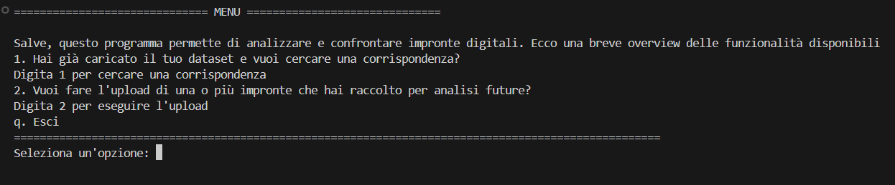
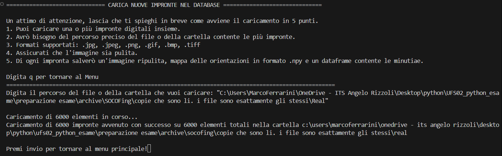
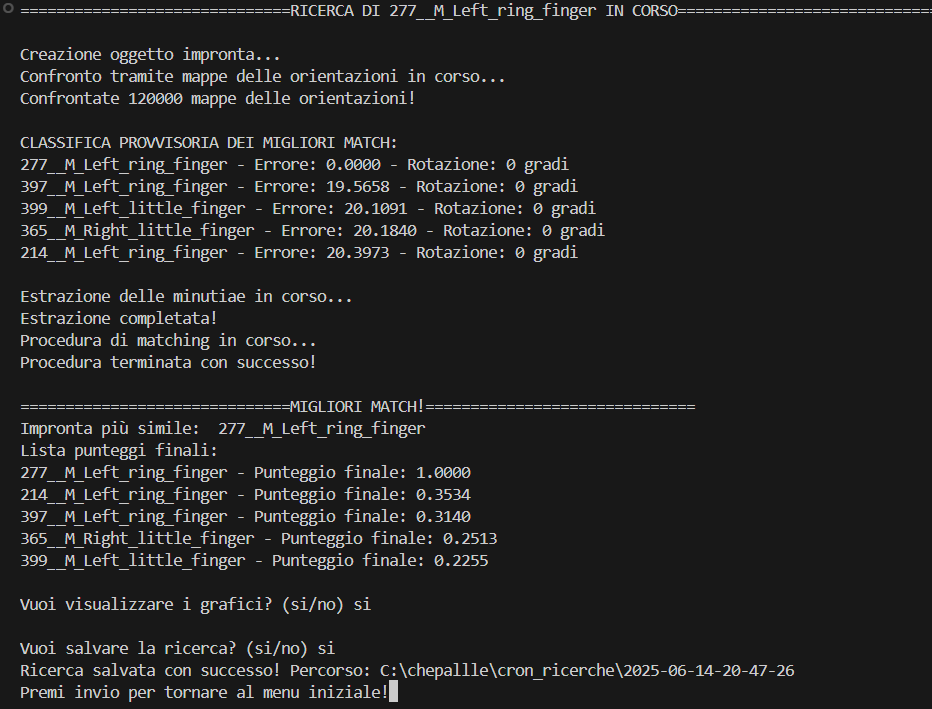
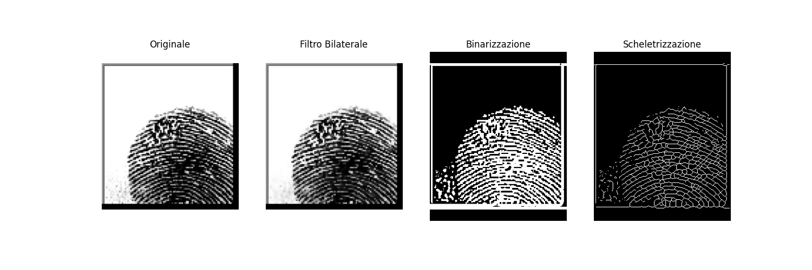
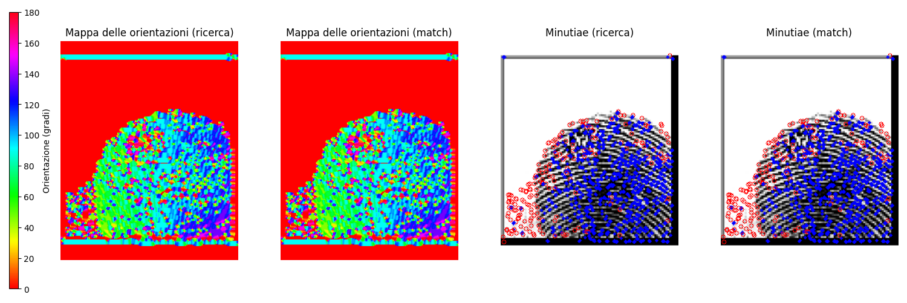

# Fingerprint Recognition System


> Tags: `fingerprint-analysis` `opencv` `forensics` `image-processing` `python` `student-project`


System for fingerprint identification, developed in Python with computer vision techniques, orientation maps and minutiae detection.

---

## Project Objectives

This project was developed as a final test for the *Python Programming* exam and constitutes a complete exercise in the field of image processing and biometric analysis. The system allows automatic loading, processing, archiving and comparison of fingerprints, addressing real challenges related to rotation, noise and image quality.

---
## Repository structure

```
fingerprint-recognition/
├── README.md
├── requirements.txt
├── .gitignore
├── presentation.pdf
├── documentation.pdf
├── src/
│   ├── main.py
│   ├── core.py
│   ├── ui.py
│   └── storage.py
├── data/
│   └── sample_data.zip
└── examples/
```

## System Architecture

Modular structure in 4 main components:

```
src/
├── main.py      # Program entry point
├── core.py      # Main algorithms for processing and comparison
├── ui.py        # Command line user interface
└── storage.py   # Data management and persistence
```

### Output Directories

```
orientationmaps/   # Orientation maps (.npy)
minutiae/          # Minutiae coordinates (.csv)
cron_upload/       # Processed fingerprints (.bmp)
cron_ricerche/     # Search results (with timestamp)
```

---

## Main Features

- **Dual Analysis**: Orientation map + minutiae
- **Rotation Compensation**: Automatic testing in configurable range (default ±15°)
- **CLI Interface**: Simplified use via terminal
- **Visualization**: Diagrams and images of processing steps and matching
- **Persistence and History**: All results are saved and chronologically ordered
- **Noise Tolerance**: Optimized for even damaged or low-quality fingerprints

---

## Implemented Algorithms

### Preprocessing
1. **Resizing** to 241×298 px
2. **Bilateral filter** to reduce noise
3. **Adaptive binarization** (gaussian)
4. **Skeletonization** with `skimage.morphology.thin`

### Feature Extraction
- **Minutiae**:
  - Terminations: 1 neighboring pixel
  - Bifurcations: ≥3 neighboring pixels
- **Orientation Map**:
  - Gradient with Sobel operators
  - Dominant direction in each cell

### Matching -- [flow diagram](https://kroki.io/mermaid/svg/eNqNlVtu2zgUht-zCo4Lwy3KoLYuluOkHUhsCwzQTIuk6ItgGLRE20RkUiDpNBMnO-ouurHhTZZkdAYVDEPk-c5P8uchNRweKKNqDg5nAIzUluzIaA5GJRZ3I3js-oYFxauKyJEDgSOueWloJfYEut4VLu42gu9ZaVRejO0z8sFa0B0W_yBeceHDUTlbn4S_kgfVImv7nCAZFyURXZ3VuIUqykgbi9ZFuE6amCQFZ2VvEmESJdExWRGhaC8-IUESkJEOP1tD1hX_XmyxUK0XW7WrPuEVqWTfjWIv7q2dKyyptBJnz8_D4dnZUQR8urHsrdKNl_lfjD5SvngFzs_fgY-Ulde4lvlavywl3dEKi-VO9yxsThO3cDo5DL4QAfiGUbCmFQGUXa3EOy4oYQorypnJHDzb1HTikoI2ycCCK6zHZ6TBAoeFhwERggsCrgy2o2zp2n82YGjAp9ufP55AGuXpZkO5YLgPL7ro31yTgeuJ_GQ6Yz7pxRFNTDrTbfri_CuvQQz0emoCrC_UaTs4tnI3ei2KfHhQAhcqF7a1JK7p6B5hc7JTE80CKAPKjOeXmjnrMm2dFdV2GeqPt2DcuJEFrRtZmN_sNQeIrgx-31iyf6TeDw8bP7IoR_qkFRh4wsAlBuj2m2dDN3ac3-Lq_oj5YOSDrhX7FXUm7Q3Mpvl7rPBHgXduBNoXchlTl0-kusaq2OYr_aaLT78uDa1PSTNug9gE9BsWImchOqk-NwkM9FHYENWwrgRR-Gu2wKykJVa8wZ1DKDoMSioVZo8YXAHV7AyK2p1B8WGgaE3BfrPHFT1BzH6g0PXEnaRpbj0gErx-ayaiFfiyJpIvuqzNTv4LfRN4eOrX5lpJrxV2dgwFHS-avpkulqrglS2pes8UMadOe85w5bcGzfyedGxv0i_yz6LULKiJ6Cl0igBd2PwPrHyZm7TFqzY2HOpLS5882ygqLOV7sga14AWR0ux8NX8xDpJkVUKpK_-OzP09DQtzt8791X7Zzy9JQaU-Ul4gimM8jY4CyexifFH8r4A0F6mecDMD-4k5CrivQV_AB8-_01Jt50H9cNku0sq6yxka0Ua9M-jxGoa9-wQejwVMI5jGMAthFsFMv0wh0r8EohnUBnvHuorpBKYBTHXCBGYBRBOI9H8IUQR1fTUWXf4LYiZDyQ)
- **Phase 1: Orientation Map**
  - Average difference + rotation
  - Selection of 5 best candidates
- **Phase 2: Minutiae**
  - Euclidean distance
  - Higher weights for same-type matches
  - Combined score: 60% minutiae, 40% orientation

---

## Classes and Modules

### `fingerprint` (in `core.py`)
Manages the entire processing pipeline:

- `resize()`, `polish()`, `find_minutiae()`, `gen_orientation_map()` → fingerprint processing
- `lay()` → Complete pipeline
- `rotate_fp(degrees)` → Image rotation
- `visual_steps()` → Visual debugging

### `search` (in `core.py`)
Manages comparison and scoring:

- `find_similar_maps()` → Orientation map comparison on all loaded fingerprints (n_fingerprints_in_memory * rotation_degrees *2 / step_width)
- `rotate_extract()` → Minutiae extraction from the 5 most similar fingerprints
- `best_match_minutiae()` → Combined score
- `visual_match()` → Final visualization

### `storage.py`
- `upload()`, `save_search()`, `check_db()`

### `ui.py`
- CLI menu, parameters, visualizations, user interaction

---

## Skills Developed

- **Computer Vision**: OpenCV, mathematical morphology, gradients, filters
- **Image Processing**: Advanced preprocessing, noise reduction
- **Biometric Analysis**: Minutiae detection and orientation mapping
- **Software Architecture**: Modular design, data persistence, CLI interface
- **Problem Solving**: Rotation management, quality variations, runtime optimization

---

## Dataset Used

- **Source**: [SOCOFing](https://www.kaggle.com/datasets/ruizgara/socofing)
- **Size**: 6,000 original images + 49,270 "damaged" divided into 3 levels (easy, medium, hard) for testing
- **Metadata**: Gender, hand, finger, alteration type if altered
- **Format**: Normalized to 241x298px

---

## Results

- **Rotation Management**: Stable matching
- **Precision**: High thanks to dual filter (orientation → minutiae)
- **Performance**: Balance between accuracy and execution time
- **Accuracy**: no errors were detected in fingerprint identification with the dataset used. Accuracy can be influenced by image quality

---

## Software Usage

```bash
# Startup
python src/main.py

# Available choices:
# 1. Search matches
# 2. Upload new fingerprints
# q. Exit
```

### Configurable parameters:
- Maximum degrees of rotation
- Rotation step
- Output visualization options
- Output graph saving

---

## Screenshots

### 1. Main menu


### 2. Loading new fingerprints into the database


### 3. Fingerprint search via path 


### 4. Fingerprint processing steps


### 5. Output graphs


---

## Requirements

- Python ≥ 3.8
- Libraries: `opencv-python`, `numpy`, `pandas`, `matplotlib`, `scikit-image`

```bash
# Cloning and installation
git clone https://github.com/yourusername/fingerprint-recognition.git
cd fingerprint-recognition
pip install -r requirements.txt
```

---

## Limitations

- Sensitive to image quality, but tolerant to partial damage
- Does not use deep learning techniques
- Matching optimized on complete images

---
## Possible future implementations
- Auto-encoder neural architecture for reconstructing damaged fingerprints


## Conclusions

This project represents a concrete demonstration of my skills in:

- **Python Programming**
- **Image Processing**
- **Modular Design**
- **File Management and Data Structures**
- **Real Biometric System Design**
